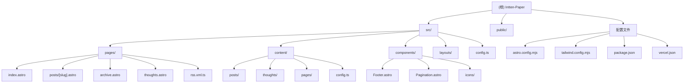

# Intten-Paper 项目文档

## 变更记录 (Changelog)

### 2026-02-08 02:53:52
- 初始化项目架构文档
- 完成全仓扫描与模块识别
- 生成项目结构图与模块索引

---

## 项目愿景

Intten-Paper 是一个基于 Astro 5 和 Tailwind CSS 构建的极简风格个人博客系统。项目专注于提供优雅的阅读体验，支持 Markdown 内容管理、RSS 订阅、标签归档、分页浏览以及浅色/深色主题切换。博客内容涵盖算法竞赛题解、学习笔记、技术教程和个人随笔。

## 架构总览

### 技术栈
- **前端框架**: Astro 5.16.6 (SSG 静态站点生成)
- **样式系统**: Tailwind CSS 3.4.19 + @tailwindcss/typography
- **部署平台**: Vercel (通过 @astrojs/vercel adapter)
- **内容管理**: Astro Content Collections (基于 Zod schema)
- **增强功能**:
  - Markdown 渲染: marked 17.0.1
  - 中英文排版优化: pangu 7.2.0
  - 数学公式渲染: KaTeX (CDN)
  - RSS 生成: @astrojs/rss
  - 站点地图: @astrojs/sitemap
  - 搜索引擎索引: astro-indexnow
  - 图标库: lucide-astro

### 核心特性
1. **内容类型**: 支持三种内容集合 (posts/thoughts/pages)
2. **响应式设计**: 移动端优先，适配多种屏幕尺寸
3. **主题系统**: 支持浅色/深色模式，跟随系统偏好或手动切换
4. **SEO 优化**: 自动生成 sitemap、RSS feed、IndexNow 推送
5. **性能优化**: 静态生成、字体预加载、CDN 资源
6. **访问统计**: 集成 Umami 分析脚本

## 模块结构图



## 模块索引

| 模块路径 | 类型 | 职责描述 | 关键文件 |
|---------|------|---------|---------|
| `src/pages/` | 路由层 | Astro 页面路由，定义站点 URL 结构 | index.astro, posts/[slug].astro, archive.astro, thoughts.astro, rss.xml.ts |
| `src/content/` | 数据层 | Markdown 内容集合，包含文章、随笔、页面 | posts/, thoughts/, pages/, config.ts |
| `src/components/` | 组件层 | 可复用 UI 组件 | Footer.astro, Pagination.astro, icons/ |
| `src/layouts/` | 布局层 | 页面布局模板 | BaseLayout.astro |
| `src/config.ts` | 配置层 | 站点全局配置（导航、社交链接、友链等） | config.ts |
| `public/` | 静态资源 | 公开访问的静态文件 | avatar.jpg, IndexNow 验证文件 |
| 根配置 | 构建配置 | 项目构建与部署配置 | astro.config.mjs, tailwind.config.mjs, package.json, vercel.json |

## 运行与开发

### 环境要求
- Node.js (推荐 LTS 版本)
- npm 或其他包管理器

### 快速开始

```bash
# 安装依赖
npm install

# 启动开发服务器 (默认 http://localhost:4321)
npm run dev

# 构建生产版本
npm run build

# 预览生产构建
npm run preview
```

### 开发工作流
1. **添加文章**: 在 `src/content/posts/` 创建 `.md` 文件，包含 frontmatter (title, date, description, tags)
2. **添加随笔**: 在 `src/content/thoughts/` 创建 `.md` 文件，包含 frontmatter (date)
3. **修改配置**: 编辑 `src/config.ts` 更新站点信息、导航、社交链接
4. **自定义样式**: 修改 `tailwind.config.mjs` 调整主题颜色、字体
5. **部署**: 推送到 Git 仓库，Vercel 自动构建部署

### 目录结构详解

```
/home/introl/object/intten/
├── src/
│   ├── pages/              # 页面路由
│   │   ├── index.astro     # 首页（文章列表）
│   │   ├── posts/[slug].astro  # 文章详情页（动态路由）
│   │   ├── page/[page].astro   # 分页路由
│   │   ├── archive.astro   # 归档页（标签云+时间线）
│   │   ├── thoughts.astro  # 随笔页（时间线布局）
│   │   ├── about.astro     # 关于页
│   │   ├── friends.astro   # 友链页
│   │   └── rss.xml.ts      # RSS feed 生成
│   ├── content/            # 内容集合
│   │   ├── posts/          # 文章 Markdown 文件 (42 篇)
│   │   ├── thoughts/       # 随笔 Markdown 文件 (2 篇)
│   │   ├── pages/          # 静态页面 (about.md)
│   │   └── config.ts       # 内容集合 schema 定义
│   ├── components/         # 可复用组件
│   │   ├── Footer.astro    # 页脚组件
│   │   ├── Pagination.astro # 分页组件
│   │   └── icons/          # 自定义图标组件
│   ├── layouts/            # 布局模板
│   │   └── BaseLayout.astro # 基础布局（导航+主题切换）
│   └── config.ts           # 站点全局配置
├── public/                 # 静态资源
│   ├── avatar.jpg          # 站点头像
│   └── 2f8b11e2db7043d2ba3130545ba313a9.txt  # IndexNow 验证
├── dist/                   # 构建输出目录（被 .gitignore 忽略）
├── .astro/                 # Astro 缓存目录（被 .gitignore 忽略）
├── node_modules/           # 依赖包（被 .gitignore 忽略）
├── astro.config.mjs        # Astro 配置
├── tailwind.config.mjs     # Tailwind CSS 配置
├── package.json            # 项目依赖与脚本
├── vercel.json             # Vercel 部署配置（重定向规则）
└── .gitignore              # Git 忽略规则
```

## 测试策略

### 当前状态
- **无自动化测试**: 项目未配置单元测试或集成测试框架
- **手动测试**: 依赖开发者本地预览和生产环境验证

### 建议测试方向
1. **内容验证**: 确保所有 Markdown 文件符合 schema 定义
2. **构建测试**: 验证 `npm run build` 无错误
3. **链接检查**: 检查内部链接和外部链接有效性
4. **响应式测试**: 在不同设备和浏览器上测试布局
5. **性能测试**: 使用 Lighthouse 评估页面性能

## 编码规范

### 文件命名
- **组件**: PascalCase (如 `Footer.astro`, `Pagination.astro`)
- **页面**: kebab-case (如 `archive.astro`, `thoughts.astro`)
- **配置**: kebab-case (如 `astro.config.mjs`, `tailwind.config.mjs`)
- **内容**: kebab-case 或中文 (如 `学习笔记-1-递归及递推.md`)

### 代码风格
- **TypeScript**: 使用类型注解，避免 `any`
- **Astro 组件**: 使用 `---` 分隔 frontmatter 和模板
- **CSS**: 优先使用 Tailwind 工具类，避免自定义 CSS
- **Markdown**: 遵循 frontmatter schema，使用标准 Markdown 语法

### 内容前置字段规范

**文章 (posts)**:
```yaml
---
title: "文章标题"
date: "YYYY-MM-DD"
description: "简短摘要"
draft: false  # 可选，默认 false
tags: ["标签1", "标签2"]  # 可选
---
```

**随笔 (thoughts)**:
```yaml
---
date: "YYYY-MM-DD"
---
```

**页面 (pages)**:
```yaml
---
title: "页面标题"
description: "可选描述"
---
```

## AI 使用指引

### 项目上下文
- **项目类型**: 静态博客站点 (SSG)
- **主要语言**: TypeScript, Astro, Markdown
- **构建工具**: Astro CLI
- **部署方式**: Vercel 自动部署

### 常见任务

#### 1. 添加新文章
```bash
# 在 src/content/posts/ 创建新文件
touch "src/content/posts/新文章标题.md"
```

文件内容模板:
```markdown
---
title: "新文章标题"
date: "2026-02-08"
description: "文章简介"
tags: ["标签1", "标签2"]
---

文章正文内容...
```

#### 2. 修改站点配置
编辑 `src/config.ts`:
- `siteConfig.title`: 站点标题
- `siteConfig.description`: 站点描述
- `siteConfig.nav`: 导航菜单
- `siteConfig.social`: 社交链接
- `siteConfig.friends`: 友情链接

#### 3. 自定义主题颜色
编辑 `tailwind.config.mjs` 的 `theme.extend.colors`:
```javascript
colors: {
  paper: 'hsl(48, 33.3%, 97.1%)',  // 浅色模式背景
  ink: 'hsl(49, 6.9%, 5.5%)',      // 浅色模式文本
  night: '#1C1C1E',                 // 深色模式背景
  moon: '#E0E0E0',                  // 深色模式文本
  accent: 'hsl(15, 63.1%, 59.6%)', // 强调色
}
```

#### 4. 添加新页面
1. 在 `src/pages/` 创建 `.astro` 文件
2. 使用 `BaseLayout` 或自定义布局
3. 更新 `src/config.ts` 的 `nav` 数组添加导航链接

#### 5. 调试构建问题
```bash
# 清除缓存
rm -rf .astro dist

# 重新构建
npm run build

# 检查构建输出
ls -la dist/
```

### 关键文件说明

| 文件 | 用途 | 修改频率 |
|------|------|---------|
| `src/config.ts` | 站点全局配置 | 高 |
| `src/content/posts/*.md` | 文章内容 | 高 |
| `src/pages/posts/[slug].astro` | 文章详情页模板 | 低 |
| `tailwind.config.mjs` | 样式主题配置 | 中 |
| `astro.config.mjs` | Astro 构建配置 | 低 |
| `vercel.json` | 部署重定向规则 | 低 |

### 依赖管理
- **核心依赖**: 定义在 `package.json` 的 `dependencies`
- **无开发依赖**: 项目未区分 devDependencies
- **版本锁定**: 使用 `package-lock.json` 锁定依赖版本

### 性能优化建议
1. **图片优化**: 使用 WebP 格式，压缩图片大小
2. **字体加载**: 已配置 Google Fonts 预连接
3. **CDN 资源**: KaTeX 和 Pangu 使用 CDN 加载
4. **静态生成**: 所有页面在构建时生成，无运行时开销

### 常见问题排查

**问题**: 文章不显示
- 检查 frontmatter 是否符合 schema
- 确认 `draft: false` 或未设置 draft 字段
- 验证日期格式为 `YYYY-MM-DD`

**问题**: 样式不生效
- 确认 Tailwind 类名正确
- 检查 `tailwind.config.mjs` 的 `content` 配置
- 清除 `.astro` 缓存重新构建

**问题**: 构建失败
- 查看错误日志定位问题文件
- 检查 TypeScript 类型错误
- 验证 Markdown frontmatter 格式

## 扩展方向

### 短期优化
1. 添加全文搜索功能 (如 Pagefind)
2. 实现评论系统 (如 Giscus)
3. 添加阅读进度条
4. 优化图片懒加载

### 长期规划
1. 支持多语言 (i18n)
2. 添加文章系列/专栏功能
3. 实现草稿预览功能
4. 集成 CMS (如 Decap CMS)

---

**文档生成时间**: 2026-02-08 02:53:52
**扫描覆盖率**: 100% (核心源码文件已全部扫描)
**项目状态**: 生产就绪，持续更新中
