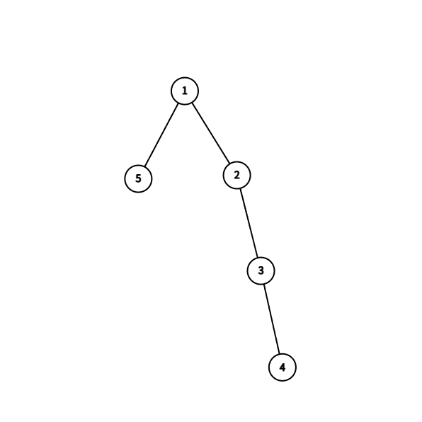

# A. Beautiful Average
求数组 $a$ 的子数组的最大平均值，显然为数组的最大值。

水题不放代码了。

# B. Beautiful String
给定一个长度为 $n$ 的二进制字符串 $s$，要求找到一个子序列 $p$，要求满足：
- 子序列 $p$ 是递减的。
- 字符串 $s$ 移除序列 $p$ 之后的字符串必须是**回文串**。
## 题目解析
显然，由于字符串只包含 $0$ 和 $1$，那么我们可以把所有的 $0$ 加入子序列，删除之后的字符串全为 $1$，自然满足回文串的要求。
# C. Beautiful XOR
给定两个整数 $a,b$，需要通过执行以下操作：

- 选择任意整数 $x$，满足 $0\le x\le a$。
- 令 $a:=a\oplus x$。

要求在 $100$ 次操作内将 $a$ 转化为 $b$。
## 题目解析
首先，考虑 $a$ 的二进制最高有效位 $\operatorname{msb}(a)$.

由于 $x$ 满足 $0\le x\le a$，那么显然，

$$\operatorname{msb}(a\oplus x)\le \operatorname{msb}(a)$$

所以如果 $\operatorname{msb}(b)>\operatorname{msb}(a)$，是无法转化成功的，直接输出 $-1$ 即可。

之后考虑剩下的情况，举个例子：

$$ a=(00101..1...)_2$$

$$ b=(00101..0...)_2$$ 

当两个数的某一位不相同时，那我们可以设 $x=(00000..1...)_2$，通过 $x\oplus a$ 将这一位更改为相同。

那么就很简单了，我们只需要遍历这两个数的二进制位 $pos(0\le pos< len(a))$，如果出现不同，则通过 $x\oplus (1<<pos)$ 来更改。

由于 $a,b$ 的最大值都为 $10^9$，都在 `int` 范围内，所以最多 $32$ 次就可以完成更改。
## Code
```cpp
#include <bits/stdc++.h>
using namespace std;
#define MULTI_CASES
#define ll long long
#define int ll
#define endl '\n'
#define vi vector<int>
#define PII pair<int, int>
const int MaxN = 2e5 + 100;
const int INF = 1e9;
const int mod = 1e9 + 7;
int T = 1, N, M;
int a[MaxN];
int getlen(int x){
    int sum=0;
    while(x>0){
        x>>=1;
        sum++;
    }
    return sum;
}
inline void Solve()
{
    int x,y;
    cin>>x>>y;
    if(x==y){
        cout<<0<<endl;
        return ;
    }
    int len=getlen(x),leny=getlen(y);
    if(leny>len){
        cout<<-1<<endl;
        return ;
    }
    int nx=x,ny=y;
    vi ans;
    for(int i=0;i<len;i++){
        int xx=(nx>>i)&1;
        int yy=(ny>>i)&1;
        if(xx!=yy){
            int cnt=(1<<i);
            ans.push_back(cnt);
            nx^=cnt;
        }
    }
    cout<<ans.size()<<endl;
    for(auto y:ans){
        cout<<y<<" ";
    }
    cout<<endl;
    cerr<<nx<<endl;
}
signed main()
{
#ifdef NOI_IO
    freopen(".in", "r", stdin);
    freopen(".out", "w", stdout);
#endif
    ios::sync_with_stdio(0);
    cin.tie(nullptr), cout.tie(nullptr);
#ifdef MULTI_CASES
    cin >> T;
    while (T--)
#endif
        Solve();
    return 0;
}
```
# D. Beautiful Permutation
交互题。

给定一个长度为 $n$ 的排列 $p$，并选择了两个整数 $l,r$，并修改了 $l\le i\le r$ 的所有 $p_i$ 为 $p_i+1$。

每次询问可以选择两个整数 $l,r$，并可以选择查询排列 $p[l...r]$ 的 **原始序列的子数组** 和或 **修改后序列的子数组和**。

要求在不超过 $40$ 次查询内找到修改时的参数 $l,r$。
## 题目解析
首先，我们可以通过查询 $(1,n)$ 获得修改后的总数组和 $sum_{2}(1,n)$。同时，由于排列的性质，我们知道原始序列的总数组和是 $\frac{n(n+1)}{2}$。那么我们可以知道修改区间的长度就是修改后的数组和减去原始序列的数组和 $len$。

那么接下来，考虑将数组一分为二。首先考虑前半段 $[1,mid]$，我们可以分别求出这段区间的原始数组和以及修改后数组和。同理通过作差法得出这段区间内，有多少个数被修改。

不难发现，总共会产生 $3$ 种情况：

- 第一种情况，修改的这段区间**全部在** $[1,mid]$ 的范围内。
- 第二种情况，修改的这段区间内**部分在** $[1,mid]$ 的范围内。
- 第三种情况，修改的这段区间**完全不在** $[1,mid]$ 的范围内。

其中，第二种情况最好处理，由于修改的区间是 **连续的**，那么这段区间的范围就是 $[mid-len_{1,mid}+1,mid-len_{1,mid}+len_{1,N}]$。

考虑其他两种情况，我们可以使用**二分法**，继续拆分区间，直到出现情况二为止。复杂度为 $O(\log n)$。
## Code
```cpp
#include <bits/stdc++.h>
using namespace std;
#define MULTI_CASES
#define ll long long
#define int ll
#define endl '\n'
#define vi vector<int>
#define PII pair<int, int>
#define endll endl,cout.flush();
const int MaxN = 2e5 + 100;
const int INF = 1e9;
const int mod = 1e9 + 7;
int T = 1, N, M;
int a[MaxN];
inline void Solve()
{
    cin>>N;
    int cursum=(N+1)*N/2;
    cout<<2<<" "<<1<<" "<<N<<endll
    int x;
    cin>>x;
    int len=x-cursum;
    cerr<<"debug "<<len<<endl;
    int l=1,r=N;
    while(l<=r){
        int n1,n2;
        int mid=(l+r)>>1;
        cout<<2<<" "<<l<<" "<<mid<<endll
        cin>>n1;
        cout<<1<<" "<<l<<" "<<mid<<endll
        cin>>n2;
        int cha=n1-n2;
        cerr<<"debug  "<<l<<" "<<r<<endl;
        if(len==1){
            if(cha==len&&l==mid){
                cout<<"! "<<l<<" "<<l<<endll
                return;
            }
        }
        if(cha==0){
            l=mid+1;
        }
        else if(cha==len){
            r=mid;
        }
        else{
            cout<<"!"<<" "<<mid-cha+1<<" "<<mid-cha+len<<endll
            return ;
        }
    }
}
signed main()
{
#ifdef NOI_IO
    freopen(".in", "r", stdin);
    freopen(".out", "w", stdout);
#endif
    ios::sync_with_stdio(0);
    cin.tie(nullptr), cout.tie(nullptr);
#ifdef MULTI_CASES
    cin >> T;
    while (T--)
#endif
        Solve();
    return 0;
}
```
# E. Beautiful Palindromes
给定一个长度为 $n$ 的数组 $a$，满足 $1\le a_i\le n$，以及一个整数 $k$。

需要执行 $k$ 次以下操作：
- 选择一个整数 $x$，且符合 $1\le x\le n$。
- 将 $x$ 添加到数组 $a$ 的末尾。

要求执行完 $k$ 次操作后，结果数组中的回文子数组的数量最小。
## 题目解析
首先，考虑如何使得回文子数组的数量最少。

第一种思路是，保证数组中的元素均不互相相同，这样显然是最少的。

但是虽然 $k\le n$，$n+k$ 也有可能出现大于 $2\times 10^5$ 的情况。

那么考虑另一种思路，假设这个数组最初没有任何元素，应该怎么操作才能使得回文子数组最小？

不难发现，每次我们只需要保证 $a_i\neq a_{i-1}$ 和 $a_i\neq a_{i-2}$，这样就可以保证不会产生回文子数组。

进一步考虑，其实我们只需要 $3$ 个数字，就可以实现自身不产生任何回文。

那么回到本题，做法就很简单了。我们只需要找到一个没有出现在 $a$ 中的数 $x$，然后选择数组 $a$ 的最后一个数作为 $z$，再选择一个不同于 $x$ 和 $z$ 的任意数字 $y$。之后按照 $x,y,z$ 的顺序输出即可。
## Code
赛时代码，写的比较复杂。
```cpp
#include <bits/stdc++.h>
using namespace std;
#define MULTI_CASES
#define ll long long
#define int ll
#define endl '\n'
#define vi vector<int>
#define PII pair<int, int>
const int MaxN = 4e5 + 100;
const int INF = 1e9;
const int mod = 1e9 + 7;
int T = 1, N, M;
int a[MaxN];
inline void Solve()
{
    cin>>N>>M;
    map<int,int>mp;
    for(int i=1;i<=N;i++){
        cin>>a[i];
        mp[a[i]]=1;
    }
    int pos=1;
    int randd=0;
    // cerr<<pos<<endl;
    for(int i=N+1;i<=N+M;i++){
        if(pos==N+1){
            randd+=1;
            pos=1;
        }
        if(mp[pos]==randd){
            // cerr<<pos<<" ";
            // cerr<<mp[pos]<<" ";
            if(pos==a[i-1]||pos==a[i-2]){
                mp[pos]++;
                pos++;
                i--;
                continue;
            }
            a[i]=pos;
            mp[pos]++;
            pos++;
            cout<<a[i]<<" ";
        }
        else{
            pos++;
            i--;
        }
    }
    cout<<endl;
    // cerr<<endl;
}
signed main()
{
#ifdef NOI_IO
    freopen(".in", "r", stdin);
    freopen(".out", "w", stdout);
#endif
    ios::sync_with_stdio(0);
    cin.tie(nullptr), cout.tie(nullptr);
#ifdef MULTI_CASES
    cin >> T;
    while (T--)
#endif
        Solve();
    return 0;
}
```
# F. Beautiful Intervals
给定了 $m$ 个区间 $[l_i,r_i]$，且满足 $1\le l_i\le r_i\le n$。

设一个长度为 $n$ 的排列 $p$，包括 $0,1,2,...,n-1$ 恰好一次。

对于每个区间 $[l_i,r_i]$，考虑其在排列中的子数组 $p[l_i,...,r_i]$，求解出 $v_i=\operatorname{mex}(p[l_i,...,r_i])$。

我们需要构造一个排列 $p$，使得 $\operatorname{mex}(v_i)$ 的值最小。

## 题目解析
首先，我们可以考虑一种构造，在序列中插入连续的 $[0,2,1]$。

不难发现，这种情况无论区间在哪，$\operatorname{mex}(M)\le 2$。

证明很简单，对于所有的区间，任意同时包含 `0` 和 `1` 的区间一定包含 `2`，那么这些区间的 `mex` 一定不等于 `2`。那么 $2\notin M$，所以 $\operatorname{mex}(M)\le 2$。

那么现在已知 $\operatorname{mex}(M)\le 2$，我们只需要分类讨论一下。

首先考虑 $\operatorname{mex}(M)=0$，也就意味着所有区间都会包含 $0$。那么我们只需要找到所有区间是否有一个公共点，并把这个公共点的值设为 $0$，那么不管其他位置怎么排列，一定满足了 $\operatorname{mex}(M)=0$。

接下来考虑 $\operatorname{mex}(M)=1$ 的情况。我们可以将其转化一下。

首先，由于 $\operatorname{mex}(M)\neq 0$，那么也就意味着不是所有的区间都包含 $0$。那么如何使得排列满足 $\operatorname{mex}(M)=1$ 呢？不难发现，对于所有包含 $0$ 的区间，只要这些区间也一定包含 $1$，那么这些包含 $0$ 和 $1$ 的区间满足 $\operatorname{mex}(v_i)>1$，而另外一部分区间满足 $\operatorname{v_i}=0$，所以最终的 $\operatorname{mex}(M)=1$。

一种可行的排列方法是：把 $0$ 和 $1$ 排列时放在一起，且保证**不存在一个区间能够把这两个数恰好分割开**。

具体而言，假设 $0$ 的位置是 $x$，我们需要保证 $1$ 位于 $x-1$ 或 $x+1$ 这两个位置之一。
同时，为了保证**不存在一个区间能够把这两个数恰好分割开**，还需要：
- 若 $1$ 位于 $x-1$，那么只需要保证 $x$ 不是任何区间的左端点，所有的包含 $0$ 的区间一定包含 $1$。
- 同理，只需要保证 $x$ 不是任何区间的右端点即可。

**注意：这两个条件只要满足其一即可。**

最后，对于不满足上述条件的情况，我们直接构造出一个 $[0,2,1]$ 即可满足 $\operatorname{mex}(M)=2$。
## Code
```cpp
#include <bits/stdc++.h>
using namespace std;
#define MULTI_CASES
#define ll long long
#define int ll
#define endl '\n'
#define vi vector<int>
#define PII pair<int, int>
const int MaxN = 2e5 + 100;
const int INF = 1e9;
const int mod = 1e9 + 7;
int T = 1, N, M;
int a[MaxN];
int l1[MaxN], r1[MaxN];
int l[MaxN], r[MaxN];
inline void Solve()
{
    memset(a,0,sizeof a);
    memset(l1,0,sizeof l1);
    memset(r1,0,sizeof r1);

    cin >> N >> M;
    for (int i = 1; i <= M; i++)
    {
        cin >> l[i] >> r[i];
        l1[l[i]]++;
        r1[r[i]]++;
        for (int j = l[i]; j <= r[i]; j++)
        {
            a[j]++;
        }
    }
    for (int i = 1; i <= N; i++)
    {
        if (a[i] == M)
        {
            cerr << 0 << endl;
            int pos=1;
            for (int j = 1; j <= N; j++)
            {
                if (j == i)
                {
                    cout << 0 << " ";
                    continue;
                }
                cout << pos << " ";
                pos++;
            }
            cout<<endl;
            return;
        }
    }
    for (int i = 1; i <= N; i++)
    {
        if (l1[i] == 0 && i > 1)
        {
            cerr << 1 << endl;
            int pos=2;
            for (int j = 1; j <= N; j++)
            {
                if (j == i - 1)
                {
                    cout << "1 ";
                    continue;
                }
                if (j == i)
                {
                    cout << "0 ";
                    continue;
                }
                cout << pos << " ";
                pos++;
            }
            cout<<endl;
            return;
        }
        if (r1[i] == 0 && i < N)
        {
            int pos=2;
            cerr << 1 << endl;
            for (int j = 1; j <= N; j++)
            {
                if (j == i)
                {
                    cout << "0 ";
                    continue;
                }
                if (j == i+1)
                {
                    cout << "1 ";
                    continue;
                }
                cout << pos << " ";
                pos++;
            }
            cout<<endl;
            return;
        }
    }
    cout << "0 2 1 ";
    for (int i = 4; i <= N; i++)
    {
        cout << i - 1 << " ";
    }
    cout << endl;
}
signed main()
{
#ifdef NOI_IO
    freopen(".in", "r", stdin);
    freopen(".out", "w", stdout);
#endif
    ios::sync_with_stdio(0);
    cin.tie(nullptr), cout.tie(nullptr);
#ifdef MULTI_CASES
    cin >> T;
    while (T--)
#endif
        Solve();
    return 0;
}
```
# G. Beautiful Tree
给定一个正整数 $n$，构造一棵树，要求符合以下要求：

令 $E$ 为树中的边集合，要求

$$S=\sum_{{u,v}\in E}(u\cdot v)$$

是一个完全平方数。
## 题目解析
光看式子可能不知道要求的是什么，我们可以先举个例子画个图。


如图，此树的 $S$ 应为：

$$S=(2\cdot 1)+(3\cdot 1)+(4\cdot 1)=9=(3)^2$$

那么如何构造才能使得 $S=(x)^2$ 呢？

我们可以先转化思路，直接令 $S=n^2$，然后尝试对于每个 $n$ 构造一种可行的方案。

例如 $n=5$，如果要满足 $S=n^2=25$，就需要构造如下的树结构：



$$S=(1\cdot 2)+(2\cdot 3)+(3\cdot 4)+(5\cdot 1)=25=(5)^2$$

现在我们知道了如何构造 $n=5$ 时的情况，那么如何扩展到更大的数字呢？

考虑 $n=6$ 的情况，可以转化思路，从 $n=5$ 来推导。由于

$$S_6-S_5=6^2-5^2=11$$

所以也就意味着，我们需要添加一个节点 `6`，同时答案要增加 $11$。我们可以先考虑式子：

$$S_6=(1\cdot 2)+(2\cdot 3)+(3\cdot 4)+(5\cdot 1)+11\\=((1\cdot 2)+(2\cdot 3)+(3\cdot 4)+(5\cdot 1))+(1\cdot 6)+(2\cdot 5)-(5\cdot 1)\\=(1\cdot 2)+(2\cdot 3)+(3\cdot 4)+(1\cdot 6)+(2\cdot 5)\\=36$$

这样就可以构造出来了，可以进一步推导验证，可以发现规律：

- 首先，固定放入 $(1,2),(2,3),(3,4)$。
- 之后，将 $n$ 与 $1$ 相连，$(n,1)$。
- 最后，对于所有 $v=5,6,...,n-1$，分别添加一条 $(2,v)$。

最后，把 $n=1,2,3,4$ 的情况特判一下即可。
## Code
```cpp
#include <bits/stdc++.h>
using namespace std;
#define MULTI_CASES
#define ll long long
#define int ll
#define endl '\n'
#define vi vector<int>
#define PII pair<int, int>
const int MaxN = 2e5 + 100;
const int INF = 1e9;
const int mod = 1e9 + 7;
int T = 1, N, M;
int a[MaxN];
inline void Solve()
{
    cin>>N;
    if(N<=2){
        cout<<-1<<endl;
        return ;
    }
    if(N==3){
        cout<<"2 3\n3 1"<<endl;
        return ;
    }
    if(N==4){
        cout<<"1 2\n1 3\n1 4"<<endl;
        return ;
    }
    cout<<N<<" 1"<<endl;
    cout<<"1 2\n2 3\n3 4"<<endl;
    for(int i=5;i<N;i++){
        cout<<i<<" 2"<<endl;
    }
}
signed main()
{
#ifdef NOI_IO
    freopen(".in", "r", stdin);
    freopen(".out", "w", stdout);
#endif
    ios::sync_with_stdio(0);
    cin.tie(nullptr), cout.tie(nullptr);
#ifdef MULTI_CASES
    cin >> T;
    while (T--)
#endif
        Solve();
    return 0;
}
```