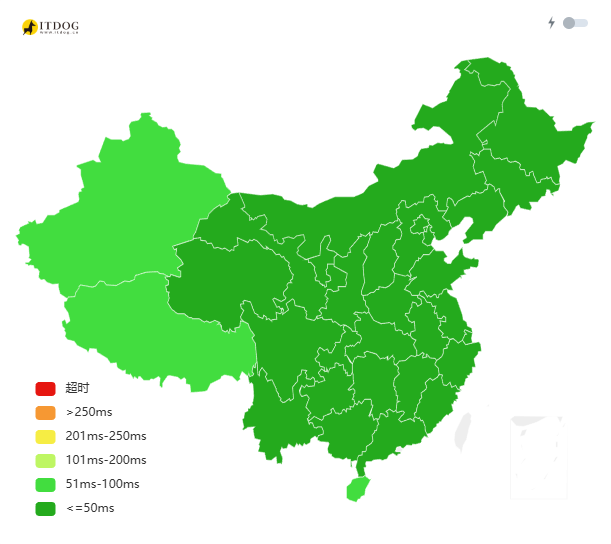

# 前言
## 什么是Home-LAB？
>Home Lab（家用实验室）是指个人或小型团队在自家环境中搭建的实验性计算环境，通常用于学习、实验、开发和测试各种技术、工具和服务。其历史可以追溯到计算机和网络技术的发展以来。

随着计算机硬件软件的快速发展，由于CPU、内存、硬盘等硬件设备的性能不断提升，以及操作系统、应用程序等软件的不断更新，HomeLab的热度逐渐增加。越来越多的的人用家里的PC搭建博客，购置专门的NAS用于存储观影、学习的视频，安装软路由系统实现虚拟上网......可见，Home Lab在如今的应用场景可谓相当广泛。
## 如何选择Home-LAB设备？
首先需要说明的是，HomeLab实际上只是一个概念，它不是一个具体的设备，而是一个搭建在个人或小型团队环境中的实验性计算环境。

大到一个机架式的服务器集群，小到一台安卓手机或者树莓派，都可以作为Home-LAB的设备。同时，其价格区间也比较灵活，从专业级的服务器设备的动辄几千上万，到洋垃圾的几十几百，都可以根据个人需求和预算进行选择。
## Home-LAB的组成
Home‑LAB 通常划分为三个子系统：传输（网络）、存储（数据）与计算（算力）。
### 传输（网络）
传输子系统主要负责数据的传输和通信，对于单一主机，其内部的数据交换传输是很简单快速的。但对于多主机的情况或者客户端访问，通常会使用网络来进行数据交换和传输。

通常而言，根据不同的需求，需要不同的网络解决方案。

**超高网络带宽需求**：
如果Home-LAB需要快速处理大量的网络流量，对速率和稳定性有较高要求，那么就需要使用光纤以太网来确保数据传输的快速和可靠。光口传输可以轻松达到10Gbps以上的传输速率，满足超高的网络带宽需求。

**2.5Gbps或1Gbps带宽需求**：
对于正常家庭而言，由于大多数家庭的外网带宽通常只有1Gbps或者更高的2.5Gbps，因此在Home-LAB中使用1Gbps或2.5Gbps的网络是比较常见的。对于这种需求，电口以太网可以轻松满足。

**高覆盖率网络需求**：
对于类似手机、pad这类移动设备，由于其移动性和便携性，通常需要使用无线网络来进行连接。当前主流的 Wi‑Fi 技术有 Wi‑Fi 5、Wi‑Fi 6/6E 与 Wi‑Fi 7，它们的核心差异如下：

- Wi‑Fi 5（IEEE 802.11ac，5 GHz）
  - 核心技术：MU‑MIMO（下行）、256‑QAM、80/160 MHz、波束成形。
  - 频段/带宽：仅 5 GHz；20/40/80/160 MHz 信道宽度。
  - 理论速率：最高约 6.9 Gbps（8 条空间流、160 MHz、256‑QAM，理想条件）。
  - 支持范围：2014 年后多数无线路由器与手机/平板/笔记本广泛支持，现已成为基础能力。
  - 实际速率：根据设备与路由支持，通常在 300 Mbps 至 866 Mbps 之间。

- Wi‑Fi 6 / 6E（IEEE 802.11ax，2.4/5（+6）GHz）
  - 核心技术：OFDMA、上下行 MU‑MIMO、1024‑QAM、BSS Coloring、TWT 等，强调并发与效率。
  - 频段/带宽：2.4/5 GHz；6E 额外支持 6 GHz（取决于地区开放）；20/40/80/160 MHz。
  - 理论速率：最高约 9.6 Gbps（多流与高带宽聚合下的理论上限）。
  - 支持范围：2019 年后中高端路由与终端逐步标配；6E 需终端/系统/地区同时支持 6 GHz。
  - 实际速率：根据设备与路由支持，通常在可以达到1200Mbps以上的速率。

- Wi‑Fi 7（IEEE 802.11be，2.4/5/6 GHz）
  - 核心技术：MLO（多链路并发）、4096‑QAM、320 MHz、Multi‑RU、增强 MU‑MIMO/多 AP 协同等，提升峰值与时延稳定性。
  - 频段/带宽：2.4/5/6 GHz；最高 320 MHz 信道宽度。
  - 理论速率：最高约 46 Gbps（更多空间流 + 320 MHz + 4K‑QAM 的理论上限）。
  - 支持范围：2023 年起高端路由上市，2024 年起部分旗舰手机/新款笔电与网卡逐步支持；向后兼容 5/6。
  - 实际速率：根据设备与路由支持，通常可以达到5Gbps以上的速率。

实际体验取决于环境与链路两端能力（速率由最慢端限制），并受信道干扰、距离与墙体衰减、国家/地区频谱开放（尤其是 6 GHz）等因素影响。

**注意，由于网络传输遵循“木桶效应”，即网络传输的速率取决于最慢的链路，因此在Home-LAB中使用1Gbps或2.5Gbps的网络时，需要注意网络中的最慢链路，以确保整体网络的传输速率不会被限制。**

### 存储（数据）
存储子系统主要负责数据的存储和管理。根据不同的需求有多种配置方案。

#### 存储介质
存储的介质大致分为两种：机械硬盘和固态硬盘。

机械硬盘（HDD）基于传统的机械结构，使用旋转的磁盘和磁头来存储数据。可以长期存储数据，但是读写速度较慢。理论上，HDD的读写速度可以达到120MB/s左右。

固态硬盘（SSD）则基于闪存技术，没有机械结构，数据存取速度非常快。SSD的读写速度通常可以达到500MB/s以上，甚至更高。当然，SSD的使用寿命低于HDD。

两者的价格差异很大，SSD的价格通常要高得多，但是读写速度快。因此，根据个人需求和预算，需要选择合适的存储介质。
#### 什么是RAID？
RAID（Redundant Array of Independent Disks，最初为 Inexpensive）是一种将多块硬盘组合为一个逻辑卷，从而在容量、性能和可用性之间进行权衡的技术。其基本手段包括：

- 条带化（Striping）：把数据分块分布到多盘并行读写，提升吞吐；不提供冗余。
- 镜像（Mirroring）：把同一份数据写入多个盘，提供冗余并提升读取并发。
- 奇偶校验（Parity）：记录校验信息，单/双盘故障时可据此重建数据。

常见 RAID 级别（简要）：
- RAID 0：仅条带化，≥2 盘；容量为各盘之和；容错为 0；读写吞吐高，但任何一盘故障都会丢失阵列数据。
- RAID 1：镜像，≥2 盘；有效容量≈单盘容量；可容忍至少 1 坏盘（取决于镜组结构）；读取并发高、写入接近单盘；适合小规模高可用。
- RAID 5：条带化 + 分布式奇偶校验，≥3 盘；容量≈`(n−1)×min(盘容量)`；可容忍 1 坏盘；读性能好，写入有校验开销，重建时间长，遇到大容量硬盘时存在 URE（不可恢复读错）风险。
- RAID 6：双重奇偶校验，≥4 盘；容量≈`(n−2)×min(盘容量)`；可容忍 2 坏盘；比 RAID 5 更安全，写入开销更高，适合大容量阵列。
- RAID 10（1+0）：先镜像再条带化，≥4 盘；容量≈总体的 50%；每个镜组可容忍 1 坏盘（不同镜组可同时）；综合性能与恢复速度好但容量利用率低。
- 其他：RAID 50/60（条带 + 奇偶，适合更大规模）；JBOD/拼盘不提供冗余，不属于 RAID。

实现方式：
- 硬件 RAID：通过专用阵列卡与缓存（常见带电池/电容保护）实现，优点是集成度高、对主机 CPU 压力小；缺点是成本高、厂商/型号绑定强，更换控制器可能影响恢复。
- 软件 RAID：由操作系统层实现，如 Linux `mdadm`、Windows Storage Spaces、TrueNAS/FreeBSD 上的 ZFS/Btrfs 等；优点是成本低、易迁移、功能丰富；缺点是需要正确配置与维护，写入开销由主机承担（对现代 CPU 影响通常不大）。
- ZFS/Btrfs：把文件系统与冗余机制整合，提供端到端校验、写时复制与 `scrub`（巡检）；`RAIDZ1/2/3` 分别近似传统 RAID5/6 的单/双/三校验，并可规避经典 RAID5/6 的“写洞”问题。

关键注意：
- RAID 不是备份：无法防止误删、勒索、系统级损坏或物理灾害；仍需按 3‑2‑1 原则做备份。
- 重建与风险：大容量硬盘的重建时间长，RAID 5 在重建过程中更易因 URE 失败；更偏向选择 RAID 6/RAIDZ2 或 RAID 10，控制单阵列规模并定期 `scrub`。
- 盘型与一致性：优先使用 CMR 硬盘而非 SMR；尽量使用容量与型号一致的硬盘；避免全部来自同一批次以降低相关性风险；可配置热备盘以缩短重建窗口。
### 计算（算力）
计算子系统主要负责数据的处理和计算，对于大多数Home-Lab来说，主要的计算模块是CPU。也是最重要的部分。

现代cpu主要有两种类型：x86和ARM，其中x86是最常用的类型，主要用于个人电脑和服务器。而ARM则主要用于移动设备和嵌入式系统。

选择CPU时，需要考虑以下几个方面：

- 性能：根据个人需求选择合适的性能水平。
- 核心数：多核心可以提高并行处理能力。
- 功耗：根据使用环境选择合适的功耗水平。
- 兼容性：确保CPU与其他硬件和软件的兼容性。
- 预算：根据个人预算选择合适的CPU。

对于一些特定的数据任务，例如视频转码，机器学习等，则需要考虑GPU。由于AI的快速发展，GPU的价格水涨船高。且由于家庭用户的算力需求一般不高，因此在Home-LAB中使用GPU时，需要考虑成本和性能的平衡。

# 我的Home-LAB配置
我个人的HomeLab配置由两台主机组成，其中一台安装了群晖系统，主要用于文件的备份和存储。另外一台主机则运行了PVE系统，通过多个虚拟机和容器来实现All In One。

## 群晖
我使用了一台早年的联想笔记本作为我的群晖主机。该笔记本的配置如下：

- CPU：AMD A4-6210@1.8GHz,4核4线程
- 内存：DDR3 4GB
- 存储：442G HDD
- 网络：1Gbps以太网口
- 系统：DSM 7.1.1-42962 Update 7

这台笔记本寿命已经有接近12年了，在性能不足以运行Windows 10的情况下，我选择了将其改造为NAS，添加了一块3.6TB的机械硬盘，并在其上运行了大量的服务。

但由于其性能水平放在当下真是过于垃圾，在高负载情况下，系统稳定性大大降低，甚至出现多次突然掉线崩溃的情况。因此，在我配置好新服务器之后，我将群晖上的所有服务迁移到了新服务器上，且仅保留了原有的442G的HDD，将3.6TB的机械硬盘迁移到了新服务器。现在这台主机仅作为相册和重要文件的定期备份服务器使用。
## PVE服务器
我的新服务器依然使用了一台旧笔记本，但要比群晖主机的配置要高得多。该笔记本的配置如下：

- CPU：Intel Core i7-9750H@2.6GHz,6核12线程
- GPU：RTX 2060M 6GB
- 内存：DDR4 16GB
- 存储：512GB NVMe SSD + 500GB HDD + 3.6TB HDD
- 网络：1Gbps以太网口
- 系统：Proxmox VE 9.0.3

这台笔记本的性能水平在当前依然可以满足大多数的使用需求，所以我选择了将其作为我的PVE服务器。

在这台服务器上，我运行了多个虚拟机和容器，来实现All In One的功能。具体配置如下：

| 服务         | 类型       | 配置说明                                      |
| ------------ | ---------- | --------------------------------------------- |
| Ubuntu       | lxc容器 | 用于运行一些项目，如PanSou、nginx、DDNS等，同时也是唯一的网络出口 |
| iStoreOS | 虚拟机 | 用作旁路由，提供网络代理、广告屏蔽等功能 |
| fnOS | 虚拟机 | 主要的存储服务器，直通两块HDD，且划分了64G的SSD作为缓存 |
| Windows11 | 虚拟机 | 备用Windows系统，用于一些需要使用Windows的软件，显卡直通 |
### Ubuntu
Ubuntu容器是主要的服务容器，运行了很多项目和服务。且作为git服务器，储存并管理我的所有项目代码。

部署的项目和服务有：
- ddns-go：ipv6动态域名解析服务，用于将ipv6地址映射到域名上。
- nginx：用于反向代理和负载均衡，提供网站访问服务。
- pansou：网盘搜索项目，提供超过60种渠道，获取12个云盘的资源。
- rtsp-stream：用于将自制监控项目转化为web-hls流，提供实时监控功能。
- sub-store：用于机场订阅统一管理转换。
- newapi：聚合AI接口，用于汇合多渠道AI资源。
- Introl's Blog：基于astro的个人博客，本地静态部署，通过反代访问。
- f1-dash：实时获取f1赛事数据。

同时，此容器也作为内网的唯一网络出口，通过ddns-go实现将公网ip暴露到域名aaa.bbb.com上，然后通过edgeone cdn和cloudflare cdn回源到此域名，将多个网页服务进行反代，提供公网访问。

这样操作之后，通过设置回源防火墙，仅允许来自cloudflare cdn的流量回源，从而保护了我的服务不被恶意攻击。

### iStoreOS
iStoreOS作为旁路由，主要负责提供网络代理、广告屏蔽、虚拟组网等功能。

网络代理使用OpenClash实现，配合sub store，实现聚合多个机场订阅，并提供完美无泄露的分流规则，实现完美的上网体验。

广告屏蔽使用AdGuard Home实现，配合自定义的广告屏蔽规则，实现全网广告屏蔽。

虚拟组网使用Tailscale实现，借助子网路由功能，只需要在旁路由上配置一次，就可以实现所有设备之间的内网通信。出门在外，只需要通过tailscale组网，并配合网络出口功能，就可以实现与家庭内网的通信和科学上网的功能。

此外，iStoreOS上还部署了一个内网测速服务，用于测试内网的网络速度。
### fnOS
fnOS作为主要的存储服务器，直通了两块机械硬盘，并划分了64G的SSD作为缓存。

在fnOS上，也部署了多个服务，如下：
- OpenList：用于聚合网盘资源，实现对多个云盘的资源进行统一管理。且借助aria实现离线下载。
- ANI-RSS：自动化追番项目，借助qbittorrent实现自动下载，且借助openlist上传资源到云盘实现外网观看。
- qbittorrent：用于下载BT文件。
- 飞牛相册：十分好用的照片备份服务，且提供相册搜索，人脸识别等高级功能。
- 飞牛影视：提供观影服务。
- iSCSI服务器：提供iSCSI储存服务，借助SSD缓存和千兆网络，可以将steam游戏安装在iSCSI储存上，实现降低电脑存储负载。
- 迅雷&百度云盘：下载资源。
- Homeassistant：用于控制智能家居设备，且借助Homekit bridge功能，实现了与Homekit的互联互通。
## 网络
为了获取公网ipv6，我将光猫桥接，使用中兴的AX3000pro巡天版作为主路由，全千兆网口，wifi6支持。可以基本满足网络需求。在主路由下，直接连接了群晖主机。

此外，为了实现网络全覆盖，我在书房部署了一个中兴的运营商定制小方糖路由器，全千兆网卡，wifi5，可以实现最高866Mbps的网络速率，同时，其可以和中兴路由器mesh组网，实现全屋wifi覆盖。同时其价格也很划算，50元2个。由于我的手机（iPhone14ProMax）的最高无线速率也就千兆出头，所以wifi5也完全够用。而需要高速网络的PC和PVE服务器则通过网线连接，实现全千兆速率。

由于开启了ipv6，在绝大多数情况下都可以成功打洞使用p2p直连，所以外网的访问延迟也很可观。我现在所在的城市是山西省孝义市，在太原测试网络延迟甚至可以达到30ms以内。

使用itdog测试全国延迟，可以发现，基本都可以保持在50ms以内。